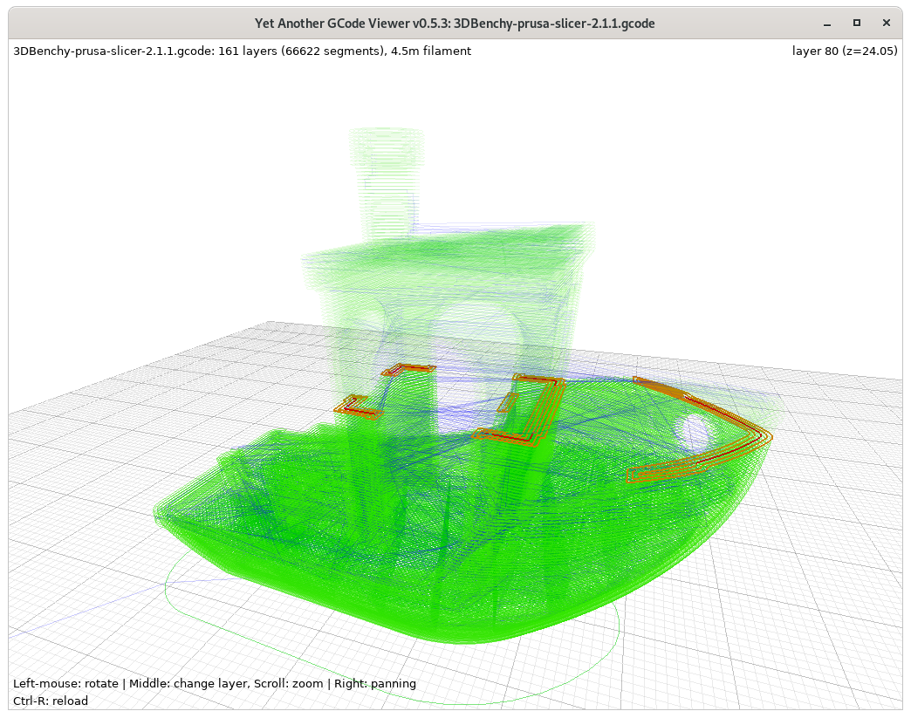

# yagv - Yet Another Gcode Viewer, v0.5.3

A fast 3D Gcode Viewer for Reprap-style 3D printers, in Python and OpenGL/pyglet



## Features

* Colors segments according to their type:
  * extruding (wall, infill, support if G-code comments are enabled in slicer)
  * motion of the head to the next extrusion point
  * retracting filament
  * restoring filament
* Allows displaying layers independently to examine them (scroll up & down)
* Automagically splits the Gcode into layers
* Automatic scaling to fit the window
* Zoom, panning and rotation

## Supported Platforms
- Ubuntu Linux 20.04 LTS [confirmed]
- Expected to work in any Linux, Windows or macOS

## Installation
```
% python3 setup.py install
 - OR -
% sudo python3 setup.py install
```

## Usage

```
% yagv [file.gcode]
```
By default, opens `data/hana_swimsuit_fv_solid_v1.gcode` if no file specified

## Issues

* Retract/restore detected but invisible (0-length segments).
* Designed with Slic3r output in mind, may not support other slicing programs (suggestions/patches welcome)
  * [Slic3r](https://slic3r.org/) 1.2.9: works
  * [PrusaSlicer](https://www.prusa3d.com/prusaslicer/) 2.1.1: works
  * [Cura](https://ultimaker.com/software/ultimaker-cura) 4.x: works
  * [Mandoline](https://github.com/Spiritdude/mandoline-py) 0.8.x: works
* Some gcodes unsupported, in particular:
  * G20: Set Units to Inches (usage unknown) 
  * Arcs (G2 & G3 ?)
  
## Changes
* 0.5.3: better support for Cura, Slic3r, PrusaSlicer and Mandoline distincting perimeter/wall/shell and infill extrusion (`;TYPE:(\w+)` Gcode comments)
* 0.5.2: new color scheme (white bg, green extrusion, red active layer), display layer# with z [mm]
* 0.5.1: `setup.py` with proper pyglet version to match code (pre-2.0), drawing bed grid
* 0.5.0: ported to Python3, added panning, smaller font

